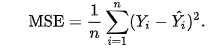

# Machine Learning Engineer Nanodegree
## Capstone Project
Joe Udacity  
December 31st, 2050

## I. Definition

### Project Overview

There has been a lot of tries to predict the stock market. As such, stock market prediction is a problem that
so many people wants to solve. One of my desire using machine learning to solve is also predicting stock market price.
The stock price is very very hard to predict but also known that it is not completely random walk. And it means
there has been somehow patterns to tackle. So I thought that the problem can be solved by using machine learning
algorithm not even 100% accurate but closer to the actual price. It is also known that there are so many company
trying to predict stock price with machine learning actually. 
In the capstone project, I created a web application that is predicting stock market price with input values 
such as tickle, which is symbol of specific company, and the future days. And training the past stock price of 
given company, the application shows the predicted value of the given future day, and the stock price graph. 

### Problem Statement

The problem to solve is very clear. The problem is to predict the future stock price and how close the predicted
price to the actual price. So I tried to predict the price of specific future day as close as possible based on
previous closing stock values. To solve this problem, I have to get the stock price data and I got the data
from 'quandl'. Because they provide very good API about the stock price. they also offer python API, so it's 
very convenient to get the stock price data. I don't need to save the stock data in csv files and load the file
to train the model or predict future price. I only do the API call and that's it.  

### Metrics

The model have to predict the specific value which means the model is regression model. So the metrics are 
related to how close the predicted value to the actual value. So I use the 'mse' or mean squared error for
metrics. Here's the definition of the MSE

https://en.wikipedia.org/wiki/Mean_squared_error
