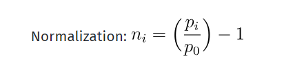

# Machine Learning Engineer Nanodegree
## Capstone Project
Joe Udacity  
December 31st, 2050

## I. Definition
_(approx. 1-2 pages)_

### Project Overview
In this section, look to provide a high-level overview of the project in layman’s terms. Questions to ask yourself when writing this section:
- _Has an overview of the project been provided, such as the problem domain, project origin, and related datasets or input data?_
- _Has enough background information been given so that an uninformed reader would understand the problem domain and following problem statement?_

There has been a lot of tries to predict the stock market. As such, stock market prediction is a problem that
so many people wants to solve. One of my desire using machine learning to solve is also predicting stock market price.
The stock price is very very hard to predict but also known that it is not completely random walk. And it means
there has been somehow patterns to tackle. So I thought that the problem can be solved by using machine learning
algorithm not even 100% accurate but closer to the actual price. It is also known that there are so many company
trying to predict stock price with machine learning actually. 
In the capstone project, I created a web application that is predicting stock market price with input values 
such as tickle, which is symbol of specific company, and the future days. And training the past stock price of 
given company, the application shows the predicted value of the given future day, and the stock price graph. 

주식시장을 예측하려는 시도는 아주 오래 전부터 있었다. 그만큼 주식 시장을 예측하는 건 
많은 사람들이 해결하기를 원하는 문제였다. 나 또한 머신러닝에 대해 공부하면서 꼭 풀어보고 싶은 문제 중 하나가 
바로 주식 가격 예측 문제였다. 주식 가격은 매우 예측하기 어려울 정도이지만 완전히 random walk는 아니라고 
알려져 있다. 그러므로 머신러닝을 사용하여 문제를 해결할 수 있을 것이라고 생각했으며 
실제로도 많은 기업에서 머신러닝을 사용하여 주식 시장을 예측하고 있다고 알려져 있다.
이 캡스톤 프로젝트에서 나는 특정 기업의 과거 주가 그래프를 분석 혹은 학습한 모델을 사용하여 미래 시점의 주가를 
예측하는 웹 어플리케이션을 만들었다. (In this project, I created a web application~) 

### Problem Statement
In this section, you will want to clearly define the problem that you are trying to solve, including the strategy (outline of tasks) you will use to achieve the desired solution. You should also thoroughly discuss what the intended solution will be for this problem. Questions to ask yourself when writing this section:
- _Is the problem statement clearly defined? Will the reader understand what you are expecting to solve?_
- _Have you thoroughly discussed how you will attempt to solve the problem?_
- _Is an anticipated solution clearly defined? Will the reader understand what results you are looking for?_

The problem to solve is very clear. The problem is to predict the future stock price and how close the predicted
price to the actual price. So I tried to predict the price of specific future day as close as possible based on
previous closing stock values. To solve this problem, I have to get the stock price data and I got the data
from 'quandl'. Because they provide very good API about the stock price. they also offer python API, so it's 
very convenient to get the stock price data. I don't need to save the stock data in csv files and load the file
to train the model or predict future price. I only do the API call and that's it.  

해결하려는 문제는 명확하다. 오늘 날짜를 기준으로 미래의 특정 시점에서의 주가를 얼마나 가깝게 예측할 수 있는지가
문제이다. 그렇기 때문에 이전 데이터를 학습한 모델을 사용하여 특정 미래 시점에서의 주가를 최대한 
실제 가격에 가깝도록 예측하려고 한다. 이를 통해 많은 사람들이 원하는 미래 특정 시점에서 특정 기업의 주가를 
예측할 수 있게 된다. 이 문제를 해결하기 위해서는 먼저 quandl 이라는 데이터 제공 사이트를 통해 데이터를 얻었다. 
이 사이트를 사용한 이유는 파이썬을 위한 api를 제공하기 때문에 별도로 데이터 파일을 저장하고 불러올 필요 없이 
네트워크만 연결되어 있으면 간단하게 데이터를 가져올 수 있기 때문이다. 
이후에는 데이터를 학습 시킨 후 그 모델을 통해서 사용자가 원하는 날짜, 원하는 기업의 주가를 보여주도록 한다.
 

### Metrics
In this section, you will need to clearly define the metrics or calculations you will use to measure performance of a model or result in your project. These calculations and metrics should be justified based on the characteristics of the problem and problem domain. Questions to ask yourself when writing this section:
- _Are the metrics you’ve chosen to measure the performance of your models clearly discussed and defined?_
- _Have you provided reasonable justification for the metrics chosen based on the problem and solution?_

The model have to predict the specific value which means the model is regression model. So the metrics are 
related to how close the predicted value to the actual value. So I use the 'mse' or mean squared error for
metrics. Here's the definition of the MSE

https://en.wikipedia.org/wiki/Mean_squared_error

 
모델은 특정 가격을 예측해야 하고 이를 특정 값과 얼마나 가까운지 혹은 특정 값에 얼마나 정확한지가 
모델의 측정 지표가 될 것이다. 그렇기 때문에 측정 지표로는 mse 를 사용할 것이다. mse 에 대한 정의는 다음과 같다.
https://en.wikipedia.org/wiki/Mean_squared_error 참고.
 

## II. Analysis
_(approx. 2-4 pages)_

### Data Exploration
In this section, you will be expected to analyze the data you are using for the problem. This data can either be in the form of a dataset (or datasets), input data (or input files), or even an environment. The type of data should be thoroughly described and, if possible, have basic statistics and information presented (such as discussion of input features or defining characteristics about the input or environment). Any abnormalities or interesting qualities about the data that may need to be addressed have been identified (such as features that need to be transformed or the possibility of outliers). Questions to ask yourself when writing this section:
- _If a dataset is present for this problem, have you thoroughly discussed certain features about the dataset? Has a data sample been provided to the reader?_
- _If a dataset is present for this problem, are statistics about the dataset calculated and reported? Have any relevant results from this calculation been discussed?_
- _If a dataset is **not** present for this problem, has discussion been made about the input space or input data for your problem?_
- _Are there any abnormalities or characteristics about the input space or dataset that need to be addressed? (categorical variables, missing values, outliers, etc.)_

The dataset is fetched by the quandl API. The size of the dataset varies from the company which to be predicted.
For example, when predict the company Amazon, I will use the recent 5 years data for the training, validating, and testing
The first 4 years dataset will be used training the predictor, and a year of the next dataset will be used
for validating the model, and the dataset from the first of this year to about March will be used to
test my model.
The dataset is obviously not included the saturday, and sunday, so the size of one year dataset is not like 
365 days.
And in this project, I only use one feature for training the predictor, Adj. Closing price. 
Here is the definition of difference between Closing and Adj. Close price.

An adjusted closing price is a stock's closing price on any given day of trading that
has been amended to include any distributions and corporate actions that occurred at any 
time before the next day's open
 https://www.investopedia.com/terms/a/adjusted_closing_price.asp
 
 

데이터셋은 quandl api 를 통해서 가져올 수 있다. 여기서 최근 5년 데이터를 사용할 것이다.
여기서 가져온 데이터 중에서 최근 4년을 학습 데이터로, 9개월을 validation set으로, 나머지 3개월의 데이터를 test set으로 사용한다.
이렇게 되면 학습 데이터는 총 958개가 나오며 validation set은 199개가 나온다. 
주말인 토,일 데이터는 포함되어 있지 않기 때문에
실제로 1년 데이터는 365개보다 적은 249개가 된다. 특성으로는 Adj. Close 1가지만을 사용할 것이다. 

### Exploratory Visualization
In this section, you will need to provide some form of visualization that summarizes or extracts a relevant characteristic or feature about the data. The visualization should adequately support the data being used. Discuss why this visualization was chosen and how it is relevant. Questions to ask yourself when writing this section:
- _Have you visualized a relevant characteristic or feature about the dataset or input data?_
- _Is the visualization thoroughly analyzed and discussed?_
- _If a plot is provided, are the axes, title, and datum clearly defined?_

Here is the stock price of the AMZN. The stock price has been increased since 1997. For model to be fitted more accurately,
the data has to be normalized. But the data has no lower bound and upper bound. So nomalization for the whole dataset
is not a good idea. Because it is not appropriate for normalizing future price data with current value. 
Because the price keeps increasing and when normalizing whole data, the early times data would not affect much 
 to the model training. So, I decide for normalizing process to has been done for each window size or time step. 
 As we'll see below, the model I chosen to predict stock price is LSTM and window size or time step matters in the model.
 Through this normalization process, the predictor would learn the pattern no matter what the absolute prices are.  

제대로 된 학습을 위해서는 window 별로 normalize할 필요가 있다고 말한다.)
그래프를 보면 데이터는 꾸준히 증가하는 추세를 보인다. 따라서 이 데이터를 그대로 학습 데이터로 사용한다면 
제대로 학습이 되지 않을 것이다. 왜냐하면 데이터 내에서 패턴을 찾아야 하는데 데이터는 상한선 혹은 하한선이 정해지지
않은 채 중가하거나 감소하기 때문이다. 그렇기 때문에 데이터 정규화 작업이 꼭 필요하다. 하지만 모든 데이터에 대해 정규화를
하는 것 역시 그다지 좋은 방법은 아니다. 왜냐하면 그렇게 되면 현재 꾸준히 증가하는 데이터를 봤을 때 과거의 값들은
현재의 값들에 비해 차이가 작기 때문에 학습에 거의 영향을 주지 않을 것이기 때문이다. 뒤에서 설명하겠지만 
시계열 데이터를 예측하기 위해서 LSTM 모델을 사용할 것인데 이 때 사용할 time step 혹은 window_size 별로 정규화를
할 것이다. 이를 통해서 특정 범위 내의 값들에 한해서만 정규화를 함으로서 과거와 현재의 절대적인 주가에 영향을 받지 않는
패턴을 학습할 수 있을 것이다.

### Algorithms and Techniques
In this section, you will need to discuss the algorithms and techniques you intend to use for solving the problem. You should justify the use of each one based on the characteristics of the problem and the problem domain. Questions to ask yourself when writing this section:
- _Are the algorithms you will use, including any default variables/parameters in the project clearly defined?_
- _Are the techniques to be used thoroughly discussed and justified?_
- _Is it made clear how the input data or datasets will be handled by the algorithms and techniques chosen?_

The LSTM is known for good performance in time series data prediction. So there has been many tries to predict 
stock price with LSTM model. The LSTM is the improved model of RNN. The RNN also used for time series prediction.
But the RNN model has gradient vanishing problem. But the LSTM model improved and solved this issue. So the LSTM
model could train well with the data far from current time and has better performance for long term time series data.
So I thought that this model is best for predicting stock price.

LSTM은 시계열 데이터 예측에 좋은 성능을 보인다. 그렇기 때문에 LSTM을 사용하여 주가를 예측하려는 많은 시도가 있다.
LSTM은 RNN을 개선한 신경망으로 RNN에서 vanishing gradient problem에 대한 해결책으로 ~한 구조를 이용한다. 이를 통해서
현재 학습하는 데이터와 시계열상으로 멀리 떨어진 데이터와도 관계가 있는 학습을 하기 때문에 특정 시계열 패턴을 파악하고
예측하는데 좋은 성능을 보인다고 한다. (좀 더 구체적인 설명..) 따라서 이 모델은 주가 예측에 가장 적합하다고 판단했다.

### Benchmark
In this section, you will need to provide a clearly defined benchmark result or threshold for comparing across performances obtained by your solution. The reasoning behind the benchmark (in the case where it is not an established result) should be discussed. Questions to ask yourself when writing this section:
- _Has some result or value been provided that acts as a benchmark for measuring performance?_
- _Is it clear how this result or value was obtained (whether by data or by hypothesis)?_

I used Linear Regression model for benchmark because this model is very simple among regression models. This model 
simply predict values based on linear relation between feature and target value. Actually, I don't think that this
model has good performance because I don't think that this model couldn't train the time series patterns. But as we'll
see below, the Linear Regression model seems much more accurate than the LSTM model.

벤치마킹 모델로는 가장 단순한 예측모델인 선형회귀 모델을 사용했다. 이 모델은 단순히 기존의 데이터를 기반으로
선형적으로 값을 예측하는 단순한 모델이다. 사실 다소 무작위적으로 보이는 주가 예측에는 별 도움이 되지 않을지도 모른다.
하지만 이전 일주일 데이터로 하루 혹은 이틀 후를 예측하거나 이전 90일로 이후 90일을 예측하는 등 추세를 예측하는데는
어느정도는 성능을 보일 것이며 매우 단순한 모델이라는 점에서 이 모델을 벤치마크 모델로 선택했다.

## III. Methodology
_(approx. 3-5 pages)_

### Data Preprocessing
In this section, all of your preprocessing steps will need to be clearly documented, if any were necessary. From the previous section, any of the abnormalities or characteristics that you identified about the dataset will be addressed and corrected here. Questions to ask yourself when writing this section:
- _If the algorithms chosen require preprocessing steps like feature selection or feature transformations, have they been properly documented?_
- _Based on the **Data Exploration** section, if there were abnormalities or characteristics that needed to be addressed, have they been properly corrected?_
- _If no preprocessing is needed, has it been made clear why?_

The preprocessing consist of following steps:
1. take data correspond to the input ticker from quandl api
2. confine the data from step 1 starting from 4 years from last date of the data.
3. pick up columns which is used to feature data.
4. split the data from step 3 into train set, validation set, and test set. At this time, each dataset should be 
saved in the form of 3D array consist of sequence, time step, and features. Because the LSTM model has one 
epochs with time step. ?? 
5. each sequence has to be normalized for better performance. The normalization is proceed by using this equation.

Here, P0 is the first value of the each sequences and the Pi is the ith value of the sequence.
The denormalization is going to be proceed when the model predict sequences multiple.  

전처리 과정은 다음과 같다.
1. quandl api를 통해 주어진 ticker 에 해당하는 데이터를 가져온다.
2. 정한 범위에 맞게 데이터를 최근 ~년 데이터로 한정한다.
3. 2에서 나온 데이터 중에서 학습하려는 feature만 골라낸다.
4. 3에서 나온 결과를 train, test 셋으로 분리한다. 이 때 각 데이터셋은 lstm에 들어가는데 이 때 데이터는
time step, feature 별로 묶어서 저장해야 한다. 왜냐하면 lstm은 정해진 갯수의 time step 통해 한 번의 학습을 하기 때문이다.
5. 4에서 데이터를 만드는 과정에서 각 sequence? 별로 normalize를 할 것이다. 정규화는 다음과 같이 진행한다.
ㅣ나러나ㅣㄻㄴㅇㄹ;ㅣㅁㄻㅇㄹ
6. 따라서 각 sequence의 첫 번째 데이터를 기준으로 이후의 데이터를 정규화한다.

### Implementation
In this section, the process for which metrics, algorithms, and techniques that you implemented for the given data will need to be clearly documented. It should be abundantly clear how the implementation was carried out, and discussion should be made regarding any complications that occurred during this process. Questions to ask yourself when writing this section:
- _Is it made clear how the algorithms and techniques were implemented with the given datasets or input data?_
- _Were there any complications with the original metrics or techniques that required changing prior to acquiring a solution?_
- _Was there any part of the coding process (e.g., writing complicated functions) that should be documented?_

The implementation process can be split into two main stages:
1. The predictor training stage
2. The application development stage

During the first stage, The predictor was trained on the preprocessed training data. And I used the LSTM model 
which provided from Kears. The whole process was done by Jupyter notebook, and can be further divided into the 
following steps:
1. Define the network architecture and training parameters.
2. Define also the loss function and optimizer. the loss function is Mean Squared Error as mentioned above, 
and the optimizer is 'adam'
3. training the LSTM model with training set. 
4. make LossHistory class for logging the loss of each epochs when training the model.
5. Plot the loss values versus epochs with training data.
6. bound the stock data to validation dataset range and evaluate the evaluation data with trained model.
7. If the loss is not good enough, return to the step 3 and increase the number of epochs or number of batch size 
or other parameters used in model.
8. save the model and store the model at the saved_model directory so that every time the app is used to predict
future price, the trained model is able to be used without long delay time.

(여기에 LSTM 모델을 그려서 추가하고 설명을 달기.)

The application development process can be split into three main stages:
1. make /index page. Here, the user input company ticker and days from now that he/she wants to know.
2. the input data is used in the /predict path. In the /predict path, the application load file which has the 
information about the trained model and use the recent data of size of the time step, and predict the stock price
of the future day which the user wants to know.
3. the predict result is showing from the /predict path with graph. To show the graph, the graph which is made from the 
step 2 saved as the file in the pyplot directory and there is the api for send the graph image file for showing the 
predicted graph on the /predict page.
     
구현 단계는 두 main 단계로 나눈다:
1. 예측 모델 학습 단계
2. 웹 어플리케이션 개발 단계

첫 번째 단계에서는 keras에서 제공하는 lstm 모델을 사용할 것이다. 
1. lstm layer는 한 단계만 사용할 것이며 예측은 ~~로 할 것이다.
2. 네트워크 구조를 정한 후 학습을 시킨다.
3. loss 함수를 정한다.
4. 학습 시키고 validation set에 대해 loss를 구한다.
5. 결과에 대한 그래프를 그린다.
6. 정확도가 높지 않다면 3단계로 돌아간다.
7. 학습한 모델을 저장한다.

다음은 모델의 구조이다.

어플리케이션 개발 단계는 다음과 같다.
1. /index 페이지를 만든다. 여기에서는 사용자가 어떤 기업의 주가를 얼마만큼 미래의 가격을 알고 싶은지를 입력한다.
2. 입력한 정보는 /predict 에서 사용된다. /predict에서는 기존에 학습한 모델을 불러오고, 최근 time step 만큼의 데이터를 
사용하여 사용자가 입력한 미래 날짜까지 예측을 하는 과정이 들어 있어야 한다. 
3. 예측한 결과는 /predict에서 그래프와 함께 보여준다. 이를 위해 2에서 예측한 그래프를 파일로 저장하고, 이미지를 불러오는
별도의 api를 만들어서 /predict에서 요청한다.

### Refinement
In this section, you will need to discuss the process of improvement you made upon the algorithms and techniques you used in your implementation. For example, adjusting parameters for certain models to acquire improved solutions would fall under the refinement category. Your initial and final solutions should be reported, as well as any significant intermediate results as necessary. Questions to ask yourself when writing this section:
- _Has an initial solution been found and clearly reported?_
- _Is the process of improvement clearly documented, such as what techniques were used?_
- _Are intermediate and final solutions clearly reported as the process is improved?_

My initial solution was not good. The model seems to predict future prices but it just looks like stock price graph
Here is my first initial solution.
(그래프 이미지)

This was improved upon by using the following techniques and proces
- state 
after googling to improve my lstm model, I found that the stateful lstml model would have much performance than 
the model that is not stateful. Here, the stateful means that the lstm model remember the current sample trained state
and pass the state to the next sample become the initial state of the next sample. So, when using this technique,
the model would be trained well. The only things to do is change the shape of batch input from (sequence, time step, features)
 to (1, time step, feature) and set the stateful parameter to 'True' and loop the each training step of LSTM model 
over sequence size. 
- increasing window size or each time step of sequence from 50 to 249.
The 50 number is just a guess. and the 249 is number of days of stock market in a year. And I made a hypothesis that
if each time step covers the year, then the model would train the pattern much more accurate than just random number.
- increase the training data to 4 years.
The reason I done this is similar to the action of increasing window size. I thought that as the training data size 
increase, the model would find the patterns much more easier.
 
After doing this, the LSTM model results like this:
(그래프 이미지)
The future values that the model predicted is not look like actual values but the trend of the stock price is well predicted.

## IV. Results
_(approx. 2-3 pages)_

### Model Evaluation and Validation
In this section, the final model and any supporting qualities should be evaluated in detail. It should be clear how the final model was derived and why this model was chosen. In addition, some type of analysis should be used to validate the robustness of this model and its solution, such as manipulating the input data or environment to see how the model’s solution is affected (this is called sensitivity analysis). Questions to ask yourself when writing this section:
- _Is the final model reasonable and aligning with solution expectations? Are the final parameters of the model appropriate?_
- _Has the final model been tested with various inputs to evaluate whether the model generalizes well to unseen data?_
- _Is the model robust enough for the problem? Do small perturbations (changes) in training data or the input space greatly affect the results?_
- _Can results found from the model be trusted?_

During development, a validation set was used to evaluate the model.
Here is the final architecture and hyperparameters I chosen:
- The number of epochs: 8
- The training data : 4years (250*4 = 1000)
- The window size or time step: 245
- The features: 'Adj. Closing'
- The layers: one lstm layer with stateful, 128 memory cell and one dense layer. 
- The user input ticker is restricted to the given company ticker ['AMZN', 'MSFT', 'DIS', 'KO']
- Likewise, the future days of user input is restricted to the 100 days from now.

개발하는 중에 validation set was used to evaluate the model
그 결과 다음과 같은 hyperparameter와 모델 구조를 가지게 됬다.
- epochs 는 ~개로 정함.
- 학습 데이터는 ~개로 정함.
- window_size 혹은 time step 은 ~로 정함
- features는 ~~로 정함.
- layers는 그냥 그대로 함. 별 차이 없어서..
- 앱에서 학습하는 데는 오래 걸리기 때문에 이미 학습한 모델만 입력할 수 있도록 함.
- 마찬가지로 LSTM 모델은 먼 미래일수록 정확도가 떨어지기 때문에 미래 날짜를 제한하도록 함.

### Justification
In this section, your model’s final solution and its results should be compared to the benchmark you established earlier in the project using some type of statistical analysis. You should also justify whether these results and the solution are significant enough to have solved the problem posed in the project. Questions to ask yourself when writing this section:
- _Are the final results found stronger than the benchmark result reported earlier?_
- _Have you thoroughly analyzed and discussed the final solution?_
- _Is the final solution significant enough to have solved the problem?_

The LSTM model and the benchmark model has difference. First, the LSTM model predict rather exact stock price than
trend of the future price. The benchmark model was Linear Regression model. The model seems like more actual stock price.
But, the absolute value of prediction price is far from the previous prices. I think the reason is that the stock prices
keep going up and the training set was same as the LSTM model so the benchmark model trained far from the current price.
So the predicted values was lower than current price but actually similar range from the past year data. 
The LSTM model is not very close to the actual price on the test set but if the model is supplemented such as adding 
special feature for training, the model prediction would be near perfection.

## V. Conclusion
_(approx. 1-2 pages)_

### Free-Form Visualization
In this section, you will need to provide some form of visualization that emphasizes an important quality about the project. It is much more free-form, but should reasonably support a significant result or characteristic about the problem that you want to discuss. Questions to ask yourself when writing this section:
- _Have you visualized a relevant or important quality about the problem, dataset, input data, or results?_
- _Is the visualization thoroughly analyzed and discussed?_
- _If a plot is provided, are the axes, title, and datum clearly defined?_

(여기에는 최종 그래프를 보여주면 될 거 같다.)
Here is the stock predictions for the five company which is Amazon, Microsoft, Berkshire Hathaway, Disney, and Coca-Cola.
The plot shows past prices and both LSTM prediction prices and the benchmark prediction prices.

### Reflection
In this section, you will summarize the entire end-to-end problem solution and discuss one or two particular aspects of the project you found interesting or difficult. You are expected to reflect on the project as a whole to show that you have a firm understanding of the entire process employed in your work. Questions to ask yourself when writing this section:
- _Have you thoroughly summarized the entire process you used for this project?_
- _Were there any interesting aspects of the project?_
- _Were there any difficult aspects of the project?_
- _Does the final model and solution fit your expectations for the problem, and should it be used in a general setting to solve these types of problems?_

First of all, the stock market prediction field keeps in my head while learning the machine learning. That much, the stock 
market prediction is very fascinating domain for me. But, it was very tough way for me that I didn't learn about the 
LSTM in the machine learning nanodegree program. Since the stock prediction is hard for using simple model such as
Linear Regression, SVM, or just neural network that I learned from the lectures, I try to choose well known model for 
time series prediction which is LSTM model. Though I did not learn the LSTM model from the nanodegree program, I have to
spend most of the time researching the concept of the model, how to implement, etc. while doing my capstone project.
That was not a good idea because the time was ticking and I rarely have time for finding more suitable hyperparameters,
features, etc. The problem was very challenging but It was also very proud that 
I implemented the model that predict what I want to see. But there has left many things to improve.

  
우선 주가 예측이라는 분야는 머신러닝을 공부하면서 계속해서 내 머릿속을 맴돌았다. 그만큼 나에게 있어서는
매력적인 도메인이였다. 하지만 강의에서 배우지 않은 머신러닝 모델인 LSTM을 사용한 건 다소 힘든 길이였다.
주가 예측은 매우 어려울 것이라 생각했기 때문에, 최대한 높은 성능을 가지는 모델을 선택하기 위함이였는데 
강의에서 다루지 않은 내용이다보니 학습을 하고 모델이 어떻게 돌아가는지 등을 익히는데 capstone project를
진행하는 데 대부분의 시간을 보낸 것 같다. 

### Improvement
In this section, you will need to provide discussion as to how one aspect of the implementation you designed could be improved. As an example, consider ways your implementation can be made more general, and what would need to be modified. You do not need to make this improvement, but the potential solutions resulting from these changes are considered and compared/contrasted to your current solution. Questions to ask yourself when writing this section:
- _Are there further improvements that could be made on the algorithms or techniques you used in this project?_
- _Were there algorithms or techniques you researched that you did not know how to implement, but would consider using if you knew how?_
- _If you used your final solution as the new benchmark, do you think an even better solution exists?_

To achieve more accurate model, it would be good to add or experiment below features:
- follow the change point of the given dataset. The change point matters because it show the trend of the stock prices
- try to use more feature to train the model. 
- do the sentimental analysis about the company that the user want to predict price on and assist this result to 
predict stock price.

chagepoint 데이터에 대한 학습을 추가하면 좋을 것 같다.
좀 더 다양한 feature를 사용해보면 좋을 거 같다.
sentimental analysis를 사용해봐도 좋을 거 같다.

-----------

**Before submitting, ask yourself. . .**

- Does the project report you’ve written follow a well-organized structure similar to that of the project template?
- Is each section (particularly **Analysis** and **Methodology**) written in a clear, concise and specific fashion? Are there any ambiguous terms or phrases that need clarification?
- Would the intended audience of your project be able to understand your analysis, methods, and results?
- Have you properly proof-read your project report to assure there are minimal grammatical and spelling mistakes?
- Are all the resources used for this project correctly cited and referenced?
- Is the code that implements your solution easily readable and properly commented?
- Does the code execute without error and produce results similar to those reported?